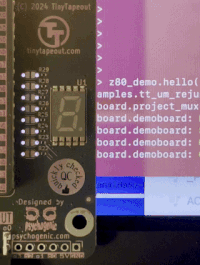

# Test FOSSi Z80 replica on Tiny Tapeout 07

This is a testing code for [FOSS Z80 silicon](https://github.com/rejunity/z80-open-silicon) on [Tiny Tapeout 07](https://tinytapeout.com/runs/tt07). Tests are written in MicroPython and will run from the RP2040 microcontroller situated on the Tiny Tapeout base board.

<p align="center">
  
</p>


## Requirements

NOTE: this all assumes you're running a Tiny Tapeout 7 demoboard, with [the SDK](https://github.com/TinyTapeout/tt-micropython-firmware/) and [MicroPython](https://www.micropython.org) installed.

On a host machine you will need [mpremote](https://docs.micropython.org/en/latest/reference/mpremote.html) tool that usually comes with MicroPython installation. Older *mpremote* versions have a bit funky behavior, so you might need to upgrade it to _1.24.1_ or later version!

If *mpremote* is missing on your host machine, install it with:
```
pip install mpremote
```

## Install tests on Tiny Tapeout board
Installation basically involves copying over the `tt_um_rejunity_z80` directory onto the micropython file system under `examples/` situated on a Tiny Tapeout 7 demoboard and accessbile to RP2040 microcontroller. Connect your Tiny Tapeout 7 demoboard to you host machine via USB cable and type:

```
mpremote cp -r tt_um_rejunity_z80 :/examples/
mpremote cp -r programs/*.com :/
mpremote reset
```

## Run

Connect to MicroPython running on your Tiny Tapeout board from the host machine:
```
mpremote
```

Once *mpremote* initiaites the connection, type:
```
import examples.tt_um_rejunity_z80.demo as demo

demo.hello()
```

To load Z80 `.com` programs in the tiniest CP/M environment, type:
```
demo.cpm("/hello.com")
```

# Plan
### Single Tiny Tapeout 07 board
- [x] **Hello world** using address bus and on board 7-segment display
- [x] **Hello world** running from **ROM**, ROM emulated by RP2040
- [x] **RAM test**, RAM emulated by RP2040
- [x] **Hello world** printed to the console, tiny CP/M environment emulated by RP2040
- [ ] Small program (fibonaci sequence?)
- [ ] Exhaustive instruction set test [ZEXALL](https://github.com/agn453/ZEXALL)
  - [x] Minimal CP/M environment emulated by RP2040, for inspiration: https://github.com/anotherlin/z80emu
  - [x] Intercept `CALL $0005`, write `C`, `DE` registers to RAM at `0..2`
  - [x] Intercept `JP $0000` when test is finished
  - [x] 16KB is enough to load and execute ZEXALL, if stack is placed at the top `LD SP, $0000`
  - [ ] Need to implement PIO MircoPython to read DATA and ADDR buses, otherwise ZEXALL will take days, for inspiration: https://github.com/rejunity/test_rejunity_ay8913
  - [ ] or in C

### External Hardware
- [ ] External ROM test
  - [ ] 3.3V <- 5V voltage level shifter for data bus
  - [ ] 3.3V -> 5V voltage level shifter for LO 8-bit addreess
  - [ ] 128 byte ROM and use 1-bit ADDR7 to communicate results back
- [ ] External RAM test
  - [ ] 3.3V <-> 5V voltage level shifter for bidirectional data bus
  - [ ] Multiplexor + 3 buffers to store LO/HI adrress bus and control signals (at least MREQ, RD, WR)

# Z80 Mircopython API

Example use:
```
from examples.tt_um_rejunity_z80.setup import setup
setup(tt) # Activate Z80 project on your TinyTapeout board

from examples.tt_um_rejunity_z80.z80 import Z80
z80 = Z80(tt) # Initialize Z80 wrapper

z80.data = 0 # NOP
print(z80.addr) # prints 0
tt.clock_project_once() # takes 4 cycles to execute NOP
tt.clock_project_once() # and advance PC by 1
tt.clock_project_once()
tt.clock_project_once()
tt.clock_project_once() # new PC will be set on adress bus
print(z80.addr) # prints 1

z80.dump() # prints control signals and address bus
```

## Other small tests included
```
import examples.tt_um_rejunity_z80.demo as demo
demo.prog_rom() # RP2040 emulates ROM, flashes LED with text
demo.prog_ram() # RP2040 emulates RAM, pushes vales on stack and prints them in the mpremote console
```
Expected results in the *mpremote* console after running `demo.prog_ram()`:
```
RAM 0xE0..0xFF:  ['0x0', '0x0', '0x0', '0x0', '0xcf', '0xde', '0xfe', '0xca', '0x37', '0x13', '0x37', '0x13', '0x37', '0x13', '0x37', '0x13']
```

